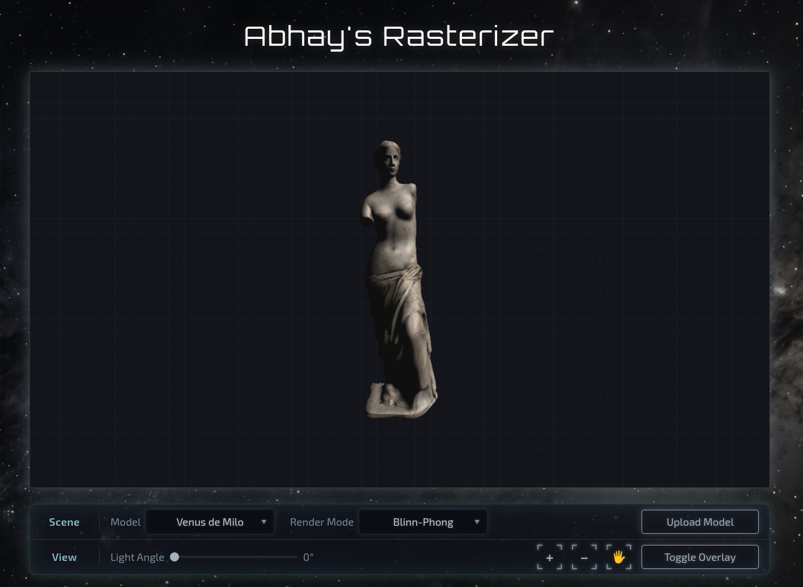

# Abhay's Rasterizer

A from-scratch **software 3D rasterizer** written in modern C++20. Triangles are transformed, clipped, and shaded entirely on the CPU with no OpenGL, Vulkan, or GPU pipeline. The same core engine runs as a native desktop app (SDL3) and in the browser (WebAssembly via Emscripten), with an interactive web UI for model selection, shading modes, lighting, and custom OBJ uploads.



---

## Table of Contents

- [Features](#features)
- [Screenshots & Demo](#screenshots--demo)
- [Architecture Overview](#architecture-overview)
- [Rendering Pipeline](#rendering-pipeline)
- [Shading Modes](#shading-modes)
- [Dependencies](#dependencies)
- [Building](#building)
  - [Native (Desktop)](#native-desktop)
  - [Web (WebAssembly)](#web-webassembly)
- [Running](#running)
- [Controls](#controls)
- [Web UI](#web-ui)
- [Uploading Custom Models (Web)](#uploading-custom-models-web)
- [Built-in Models](#built-in-models)
- [Configuration](#configuration)
- [Math & Coordinate Systems](#math--coordinate-systems)
- [Performance](#performance)
- [Development](#development)
- [Author](#author)

---

## Features

- **CPU software rasterization** at 1920×1080 with depth buffering
- **Four render modes**: wireframe, flat, Gouraud, and Blinn-Phong
- **Wavefront OBJ / MTL loading** with diffuse color, specular highlights, shininess (`Ns`), and diffuse texture maps (`map_Kd`)
- **Automatic mesh normalization**: models are centered and scaled to a consistent bounding size on load
- **Back-face culling** and near-plane clipping
- **Perspective-correct** attribute interpolation (normals, UVs, depth)
- **Textured rendering** via nearest-neighbor sampling (stb_image)
- **Interactive camera**: orbit, pan, zoom, and reset
- **Adjustable directional light** with keyboard and slider control
- **Dual targets**:
  - **Native**: SDL3 window with keyboard + mouse input
  - **Web**: Emscripten build with HTML/JS controls, drag-and-drop model upload, and sensitivity settings
- **Performance overlay** showing frame time, FPS, and visible face count

---

## Architecture Overview

```
┌─────────────────────────────────────────────────────────────────┐
│                         Application Layer                       │
│  main.cpp  (SDL3 callbacks, input, scene setup, web bridge)     │
│  web/      (index.html, app.js, styles.css browser UI)          │
└────────────────────────────┬────────────────────────────────────┘
                             │
┌────────────────────────────▼────────────────────────────────────┐
│                          Scene Layer                            │
│  scene.cpp (model/view/projection, culling, draw dispatch)      │
└────────────────────────────┬────────────────────────────────────┘
                             │
┌────────────────────────────▼────────────────────────────────────┐
│                       Rasterizer Layer                          │
│  rasterizer.cpp (Bresenham lines, triangle fill, shading)       │
└────────────────────────────┬────────────────────────────────────┘
                             │
┌────────────────────────────▼────────────────────────────────────┐
│                     Foundation Layer                            │
│  math.cpp      (Mat4, transforms, perspective projection)       │
│  parser.cpp    (OBJ/MTL parsing, mesh normalization)            │
│  texture.cpp   (image loading and sampling)                     │
│  frame_buffer  (color + depth buffers)                          │
└─────────────────────────────────────────────────────────────────┘
```

The engine follows a classic immediate-mode software renderer layout:

1. **Load** geometry and materials from disk (or MEMFS on web).
2. **Transform** vertices through model → view → projection matrices each frame.
3. **Cull** back faces and clip against the near plane.
4. **Rasterize** visible triangles into a CPU framebuffer with z-buffering.
5. **Present** the framebuffer via SDL texture blit (native or canvas on web).

---

## Rendering Pipeline

Each frame, `draw_scene()` in `src/scene.cpp` executes the following steps:

### 1. Model-View Transform

Every vertex position and normal is multiplied by `view * model`. View-space position is stored in `vertex.view_pos` for Phong shading.

### 2. Back-Face Culling & Near Clipping

For each face:

- Skip if any vertex lies behind the near plane (`z > -NEAR`).
- Compute face normal via cross product of two edges.
- Discard if the normal faces away from the camera (dot with `(0, 0, -1) < 0`).

### 3. Perspective Projection

Vertices are multiplied by a fixed perspective matrix (`project()` in `math.cpp`), then divided by `w` to obtain NDC coordinates. Screen-space mapping:

```
screen_x = (ndc_x + 1) * WIDTH / 2
screen_y = (1 - ndc_y) * HEIGHT / 2
```

### 4. Attribute Pre-Division

Before rasterization, normals and UVs are divided by clip-space `w` so that perspective-correct interpolation can be recovered during triangle fill via:

```
w_correct = 1 / interpolate(1/w_a, 1/w_b, 1/w_c, barycentrics)
attribute = interpolate(attr_a/w, ...) * w_correct
```

### 5. Triangle Rasterization

For each pixel inside the triangle bounding box:

1. Compute barycentric coordinates (2D determinant test).
2. Interpolate depth; reject if behind the z-buffer.
3. Shade the pixel according to the active `RenderMode`.
4. Write color and depth to the framebuffer.

---

## Shading Modes

| Mode | Enum | Description |
|------|------|-------------|
| **Wireframe** | `RenderMode::Wireframe` | Edge-only rendering via Bresenham line algorithm |
| **Flat** | `RenderMode::Flat` | Single Lambert brightness per face using the face normal |
| **Gouraud** | `RenderMode::Gouraud` | Per-vertex Lambert shading, interpolated across the triangle |
| **Blinn-Phong** | `RenderMode::Phong` | Per-pixel normal interpolation + Blinn-Phong specular using the half-vector `H = normalize(L + V)` |

All shaded modes apply:

- **Ambient term**: `AMBIENT = 0.2`
- **Diffuse**: material `Kd` color or texture sample
- **Specular** (Phong only): material `Ks` raised to `shine_log2` power (derived from MTL `Ns`)
- **Output clamping**: channels clamped to `[15, 255]` to avoid pure black crush

Light direction is a normalized vector derived from a rotatable angle:

```
light_dir.x = sin(angle)
light_dir.y = 1.0
light_dir.z = cos(angle)
light_dir = normalize(light_dir)
```

The light vector is transformed into view space before shading.

---

## Dependencies

### Native Build

| Dependency | Purpose |
|------------|---------|
| **C++20 compiler** (GCC/Clang) | Language features (`std::numbers`, designated init) |
| **CMake ≥ 3.20** | Build system |
| **SDL3** | Window, renderer, texture streaming, input events |

### Web Build

| Dependency | Purpose |
|------------|---------|
| **Emscripten (emcc)** | Compile C++ to WebAssembly + JS glue |
| **Python 3** | Local HTTP server for development (`just run-web`) |

### Bundled

| Library | Location | Purpose |
|---------|----------|---------|
| **stb_image** | `include/stb_image.h` | PNG/JPEG texture loading |

---

## Building

### Native (Desktop)

Requires SDL3 installed and discoverable by CMake.

```bash
# Using just (recommended)
just build

# Or manually
cmake -B build -DCMAKE_BUILD_TYPE=Debug -DCMAKE_EXPORT_COMPILE_COMMANDS=ON
cmake --build build/
```

The executable is written to `build/main`.

Compiler flags (from `CMakeLists.txt`):

- `-Wall -Wextra -Werror -Wsign-conversion`
- `-O3 -g -march=native -ffast-math -flto`

`web_api.cpp` is excluded from the native target.

### Web (WebAssembly)

Requires Emscripten in your `PATH`.

```bash
just web
# or
./build-web.sh
```

This produces `web/rasterizer.js` and `web/rasterizer.wasm`, embedding the `models/` and `textures/` directories into the WASM virtual filesystem.

Emscripten flags include `-sUSE_SDL=3`, `-msimd128`, `-O3`, `-flto`, and `-sALLOW_MEMORY_GROWTH=1`.

Build both targets:

```bash
just build-all
```

Clean artifacts:

```bash
just clean
```

---

## Running

### Native

```bash
just run
# equivalent to: just build && ./build/main
```

Launch from the `models/` directory context. Paths are relative (`models/`, `textures/`).

### Web

```bash
just run-web
```

This starts a Python HTTP server on port 8000 serving the `web/` directory and attempts to open Chromium. Navigate to:

```
http://localhost:8000
```

Ensure `just web` has been run first so `rasterizer.js` and `rasterizer.wasm` exist.

---

## Controls

### Mouse

| Action | Default | Hand Tool (🖐) Active |
|--------|---------|---------------------|
| **Rotate** | Left drag | Right drag |
| **Pan** | Right drag | Left drag |
| **Zoom** | Scroll wheel | Scroll wheel / + − buttons (web) |

### Keyboard

| Key(s) | Action |
|--------|--------|
| **F1 – F4** | Render mode: Wireframe / Flat / Gouraud / Blinn-Phong |
| **1 – 5** | Select built-in model (see [Built-in Models](#built-in-models)) |
| **T / Y / U** | Rotate around X / Y / Z (hold for continuous rotation) |
| **W / S** | Zoom in / out |
| **A / D** | Move camera horizontally |
| **R / F** | Move camera vertically |
| **J / K / O / L** | Pan camera target |
| **N** | Step light angle |
| **H** | Reset camera to defaults |
| **I** | Toggle FPS / face-count overlay |

On web, keyboard shortcuts work when the canvas has focus. The help modal (`?` button) lists the full control map.

---

## Web UI

The browser interface (`web/index.html` + `app.js`) provides:

- **Model selector**: built-in meshes plus "User Upload"
- **Render mode selector**: wireframe through Blinn-Phong
- **Light angle slider**: 0°–360° with live degree readout
- **Zoom buttons**: dispatch synthetic wheel events to the WASM canvas
- **Hand tool toggle**: swaps left/right drag behavior (rotate ↔ pan)
- **Overlay toggle**: show/hide frame timing stats
- **Upload modal**: drag-and-drop OBJ, optional MTL and textures
- **Settings modal** (gear icon): rotate, pan, and zoom sensitivity sliders (1–20 scale)
- **Help modal** (`?`): full control reference table

JavaScript communicates with WASM through Emscripten `ccall`/`cwrap` exports defined in `src/web_api.cpp`:

| Export | Purpose |
|--------|---------|
| `_set_model` | Switch active scene object |
| `_set_render_mode` | Change shading mode |
| `_set_light_angle` | Set directional light rotation |
| `_toggle_overlay` | Show/hide stats overlay |
| `_toggle_swap_mouse` | Swap rotate/pan mouse buttons |
| `_set_rotate_sens` / `_set_pan_sens` / `_set_zoom_sens` | Camera sensitivity |
| `_reload_user_mesh` | Re-parse `models/user.obj` from MEMFS |
| `_has_user_mesh` | Query whether user upload succeeded |

C++ can sync UI state back via `EM_ASM` helpers (`web_sync_model_dropdown`, etc.) when keyboard shortcuts are used inside WASM.

---

## Uploading Custom Models (Web)

1. Click **Upload Model** in the controls panel.
2. Provide a **required** `.obj` file.
3. Optionally provide a matching `.mtl` and texture images.
4. Click **Upload**.

Files are written into Emscripten's in-memory filesystem:

```
models/user.obj          ← renamed from your OBJ upload
models/<your.mtl>        ← original MTL filename preserved
textures/<image files>   ← referenced by map_Kd paths in MTL
```

The parser reloads the mesh, centers it, scales it to `TARGET_SIZE` (25 units), and resets the camera.

### Upload Checklist

- OBJ opens correctly in Blender or another viewer
- Quads are split automatically; n-gons only render their first triangle
- `mtllib` in the OBJ matches the uploaded MTL filename
- Texture paths in the MTL are **relative**, not absolute
- Texture filenames have no spaces, no backslashes, ASCII only
- Texture filenames in the MTL match uploaded image names exactly (case-sensitive)

---

## Built-in Models

| Key / ID | Name | Files |
|----------|------|-------|
| **1 / 0** | Venus de Milo | `venus.obj`, `venus.mtl`, `venus.jpg` |
| **2 / 1** | 2099 Spacecraft | `spaceship.obj`, `spaceship.mtl`, `spaceship.jpg` |
| **3 / 2** | Male Skull | `skull.obj`, `skull.mtl`, `skull.jpg` |
| **4 / 3** | Alligator Snapper | `terrorpin.obj`, `terrorpin.mtl`, `terrorpin.jpg` |
| **5 / 4** | Messerschmitt Bf 109 | `plane.obj`, `plane.mtl`, `plane.jpg` |
| **5 (web)** | User Upload (web only) | Loaded at runtime via MEMFS |

Some models have custom initial transforms (position, rotation, scale) set in `main.cpp`. For example, Venus and Skull are rotated −90° on X and placed at `z = -20`.

---

## Configuration

Key constants in `include/config.hpp`:

| Constant | Value | Description |
|----------|-------|-------------|
| `WIDTH` / `HEIGHT` | 1920 × 1080 | Internal render resolution |
| `FOV` | π/2 (90°) | Vertical field of view |
| `NEAR` / `FAR` | 1.0 / 100.0 | Clip planes |
| `AMBIENT` | 0.2 | Ambient light intensity |
| `MODEL_PATH` | `"models/"` | OBJ/MTL search prefix |
| `TEXTURE_PATH` | `"textures/"` | Texture search prefix |

Default input sensitivity (`InputSens`):

| Parameter | Default | Web slider default |
|-----------|---------|-------------------|
| Rotate | 0.005 | Level 5 / 20 |
| Pan | 0.05 | Level 5 / 20 |
| Zoom | 0.5 | Level 10 / 20 |
| Light step | 0.1 | N/A |

---

## Math & Coordinate Systems

- **Column-major 4×4 matrices** stored in `Mat4::m` with indexing `m[j * 4 + i]`.
- **Model matrix**: `T * Rx * Ry * Rz * S` (translation, Euler rotations, scale).
- **View matrix**: standard look-at from `Camera::pos` toward `Camera::target` with up vector `(0, 1, 0)`.
- **Projection matrix**: OpenGL-style perspective with `w = -z` (see `project()` in `math.cpp`).
- **Face winding**: counter-clockwise faces (when viewed from outside) are front-facing after culling.
- **UV convention**: OBJ `vt` V coordinate is flipped (`1.0 - v`) on import to match texture orientation.

### OBJ Parser Capabilities

Supported directives:

| Directive | Handling |
|-----------|----------|
| `v` | Position (optional homogeneous `w`) |
| `vt` | Texture coordinates |
| `vn` | Vertex normals |
| `f` | Triangles; quads split into two triangles; n-gons partially handled |
| `mtllib` | Loads companion MTL file |
| `usemtl` | Assigns material to subsequent faces |

If no vertex normals exist, face normals are computed and averaged per vertex.

On load, meshes are **auto-normalized**: bounding box computed, centered at origin, scaled so the longest axis equals `TARGET_SIZE` (25.0).

### MTL Parser Capabilities

| Directive | Maps to |
|-----------|---------|
| `newmtl` | New material entry |
| `Kd` | Diffuse color |
| `Ks` | Specular color |
| `Ns` | Shininess → `shine_log2 = log2(Ns)` |
| `map_Kd` | Diffuse texture (loaded from `textures/`) |

---

## Performance

The renderer is optimized for throughput on modern CPUs:

- **`-O3 -march=native -ffast-math -flto`** on native builds
- **SIMD128 (`-msimd128`)** on WASM builds
- **Bounding-box rasterization**: only pixels inside the triangle AABB are tested
- **Early depth rejection**: z-buffer check before shading
- **Back-face culling**: roughly halves triangle workload for closed meshes
- **Shininess as log2 exponent**: specular power computed via repeated squaring instead of `pow()`

Profile a native run:

```bash
just profile
# then: perf report
```

Toggle the overlay (`I` key) to see real-time frame time, FPS, and visible face count.

---

## Development

### Just Recipes

| Recipe | Description |
|--------|-------------|
| `just build` | Configure + compile native target |
| `just run` | Build and launch desktop app |
| `just web` | Build WASM target |
| `just run-web` | Serve web directory on port 8000 |
| `just build-all` | Build native + web |
| `just debug` | Launch under GDB |
| `just profile` | Record with `perf` |
| `just clean` | Remove `build/` and generated WASM artifacts |
| `just copy-cpp` | Copy all headers/sources to clipboard (helper) |

### Adding a New Built-in Model

1. Place `model.obj`, `model.mtl`, and textures in `models/` and `textures/`.
2. Add a static `Mesh` and `SceneObject` in `src/main.cpp`.
3. Wire a keyboard shortcut and (for web) a dropdown option + `select_builtin_model` case.
4. Rebuild both native and web targets.

---

## Author

**Abhay Manoj**

- GitHub: [github.com/melchior729](https://github.com/melchior729)
- LinkedIn: [linkedin.com/in/abhaymanoj729](https://linkedin.com/in/abhaymanoj729)
